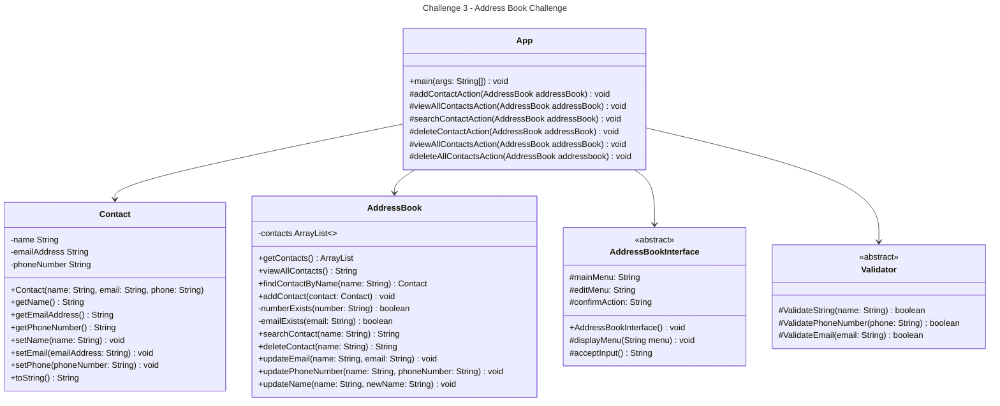

# Domain Models, Class Diagrams and Test Plan

## Class Diagram

## User Stories and Test Plans

**1. As a user, I want to be able to add a contact to the address book, with at least a name, email and phone number, so that I can keep track of my contacts.** 
 - [ ] a. Contact constructor should correctly set the name, email and phone number of the contact.
 - [ ] b. Validator should throw an exception when a null element is passed as a parameter.
 - [ ] c. Validator should throw an exception when an empty element is passed as a parameter.
 - [ ] d. Validator should throw an exception when a phone number is formatted incorrectly.
 - [ ] e. Validator should throw an exception when an email is formatted incorrectly.
 - [ ] f. Create a new contact with a valid name, email and phone number, and add it to the address book. Verify that the address book length increases by 1.
 - [ ] g. Add two contacts to the address book and expect the length of contacts to be 2.
 - [ ] h. AddContact should print a success message when a contact is added successfully.  
**2. As a user, I want to only store contacts with unique phone numbers and emails, so that I don't duplicate contacts.** 
 - [ ] a. Add a contact with a phone number that already exists in the address book. Expect an exception to be thrown.
 - [ ] b. Add a contact with an email that already exists in the address book. Expect an exception to be thrown.
 - [ ] c. Add a contact with a duplicate name and expect the contact to be added successfully.  
**3. As a user, I want to be able to view all contacts in my address book, so that I can get a general contact overview.** 
 - [ ] a. ViewAllContacts should return a list of all contacts in the address book.
 - [ ] b. ViewAllContacts should throw an exception when the address book is empty.  
**4. As a user, I want to be able to search for a user by name, so that I can pull up details about a specific contact.** 
 - [ ] a. SearchContact should return a single contact when a valid name is passed as a parameter and the contact exists in the address book.
 - [ ] b. SearchContact should return multiple contacts when a partial name is passed and multiple contacts exist in the address book.
 - [ ] c. SearchContact should return an error message when the contact does not exist in the address book.  
**5. As a user, I want to be able to remove a contact from my address book, so that I no longer have that persons details.** 
 - [ ] a. RemoveContact should remove a single contact from the address book when a valid name is passed as a parameter.
 - [ ] b. RemoveContact should not remove any contacts when a name matching more than one contact is passed as a parameter.
 - [ ] c. RemoveContact should return an error message when the contact does not exist in the address book.  
**6. As a user, I want to be able to edit a contacts details, so that I can keep them up to date.** 
 - [ ] a. findContactByName should return a contact when a valid name is passed and throw an exception when the contact doesnt exist.
 - [ ] a. UpdateEmail should update the email of a contact when a valid name and email is passed as a parameter or throw an exception if the contact doesn't exist.
 - [ ] b. UpdatePhone should update the phone number of a contact when a valid name and phone are passed as a parameter or throw an exception if the contact doesn't exist.
 - [ ] c. UpdateName should update the name of a contact when a valid name and new name are passed as a parameter or throw an exception if the contact doesn't exist.  
**7. As a user, I want to be able to interact with this application through a command line interface, so that I can easily add, view, search, remove and edit contacts.** 
 - [ ] a. DisplayMenu should print a list of main options to the console.
 - [ ] b. AcceptInput should return the user input as a string.
 - [ ] c. The application should alert the user when an incorrect option has been pressed.
 - [ ] d. The editMenu should be shown when the user selects the edit contact option.

### Additional Criteria:

**8. As a user, I want to be able to search a user by phone number, so that I can find other details about specific users** 
- [ ] a. SearchContact should accept a phone number as an argument and return a string if it matches a contact.

**9. As a user, I want to be able to search a user by email address, so that I can find other details about specific users** 
- [ ] a. SearchContact should accept an email address as an argument and return a string if it matches a contact.

**10. As a user, I want to be able to delete all users at once, so that I can clear my addressbook** 
- [ ] a. The user should be prompted to confirm they want to delete all contacts.
- [ ] b. deleteAllUsers should remove every contact from the addressbook when the user confirms

